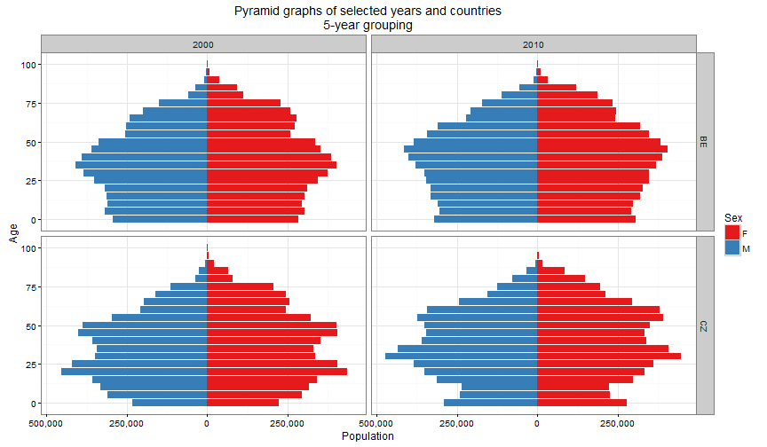

## Introduction

R is not just big scary console window, where you need to enter you code. It can also be a nice [report](http://www.zubrand.github.io/R-Tutorial) or [presentation](http://www.zubrand.github.io/R-Tutorial/Presentation).

This is a simple example how you can communicate your results from R in the form of presentation, which you can open in your web browser without a need to install R.

One of the greatest advantage of such presentation is automation and reproducibility. If you change some input data or some part of your algorithm, R will automatically generate new presentation and manual actions of copy-pasting results in presentation are avoided. Also, if you need your results to be reproducible, R presentation is definitely for you.


---

## Show your calculations


```r
# Index of masculinity
Ratios <- dt_pyramid %>% 
       filter(Geo %in% c("CZ","ES","NO","SE","DE_TOT") & between(Year, 2000, 2010)) %>%
       group_by(Year, Geo) %>% summarize(Masculinity = sum(M)/sum(F))
# Sauvy's index
     Ratios <- dt_pyramid %>% mutate(Tot = M + F) %>% group_by(Year, Geo, Gen_bio) %>% 
       summarize(Tot = sum(Tot)) %>% 
       dcast(Year + Geo ~ Gen_bio, value.var = "Tot", fun.aggregate = sum, na.rm = T) %>%
       setNames(c("Year", "Geo", "I", "II", "III")) %>% mutate(Sauvy = III/I) %>%
       select(Year, Geo, Sauvy) %>% merge(Ratios)
# Indeces for economical generations
     Ratios <- dt_pyramid %>% mutate(Tot = M + F) %>% group_by(Year, Geo, Gen_eco) %>% 
       summarize(Tot = sum(Tot)) %>% 
       dcast(Year + Geo ~ Gen_eco, value.var = "Tot", fun.aggregate = sum, na.rm = T) %>%
       setNames(c("Year", "Geo", "I", "II", "III")) %>% 
       mutate(TDR = (I+III)/II, OADR = III/II, JADR = I/II, Seniority = III/I) %>% 
       select(-I,-II,-III) %>% merge(Ratios)
```

---

## Show your results

<!-- html table generated in R 3.3.0 by xtable 1.8-2 package -->
<!-- Sun Jul 10 13:31:46 2016 -->
<table border=1>
<tr> <th>  </th> <th> Year </th> <th> Geo </th> <th> TDR </th> <th> OADR </th> <th> JADR </th> <th> Seniority </th> <th> Sauvy </th> <th> Masculinity </th>  </tr>
  <tr> <td align="right"> 1 </td> <td align="right"> 2000 </td> <td> CZ </td> <td align="right"> 0.593 </td> <td align="right"> 0.220 </td> <td align="right"> 0.373 </td> <td align="right"> 0.589 </td> <td align="right"> 1.922 </td> <td align="right"> 0.948 </td> </tr>
  <tr> <td align="right"> 2 </td> <td align="right"> 2000 </td> <td> DE_TOT </td> <td align="right"> 0.602 </td> <td align="right"> 0.260 </td> <td align="right"> 0.342 </td> <td align="right"> 0.762 </td> <td align="right"> 2.242 </td> <td align="right"> 0.953 </td> </tr>
  <tr> <td align="right"> 3 </td> <td align="right"> 2000 </td> <td> ES </td> <td align="right"> 0.621 </td> <td align="right"> 0.271 </td> <td align="right"> 0.349 </td> <td align="right"> 0.777 </td> <td align="right"> 2.197 </td> <td align="right"> 0.959 </td> </tr>
  <tr> <td align="right"> 4 </td> <td align="right"> 2000 </td> <td> NO </td> <td align="right"> 0.699 </td> <td align="right"> 0.259 </td> <td align="right"> 0.440 </td> <td align="right"> 0.589 </td> <td align="right"> 1.571 </td> <td align="right"> 0.980 </td> </tr>
  <tr> <td align="right"> 5 </td> <td align="right"> 2000 </td> <td> SE </td> <td align="right"> 0.709 </td> <td align="right"> 0.296 </td> <td align="right"> 0.414 </td> <td align="right"> 0.715 </td> <td align="right"> 1.936 </td> <td align="right"> 0.977 </td> </tr>
  <tr> <td align="right"> 6 </td> <td align="right"> 2001 </td> <td> CZ </td> <td align="right"> 0.581 </td> <td align="right"> 0.218 </td> <td align="right"> 0.363 </td> <td align="right"> 0.601 </td> <td align="right"> 2.002 </td> <td align="right"> 0.949 </td> </tr>
  <tr> <td align="right"> 7 </td> <td align="right"> 2001 </td> <td> DE_TOT </td> <td align="right"> 0.607 </td> <td align="right"> 0.268 </td> <td align="right"> 0.340 </td> <td align="right"> 0.787 </td> <td align="right"> 2.290 </td> <td align="right"> 0.954 </td> </tr>
  <tr> <td align="right"> 8 </td> <td align="right"> 2001 </td> <td> ES </td> <td align="right"> 0.610 </td> <td align="right"> 0.272 </td> <td align="right"> 0.338 </td> <td align="right"> 0.804 </td> <td align="right"> 2.240 </td> <td align="right"> 0.961 </td> </tr>
  <tr> <td align="right"> 9 </td> <td align="right"> 2001 </td> <td> NO </td> <td align="right"> 0.695 </td> <td align="right"> 0.256 </td> <td align="right"> 0.440 </td> <td align="right"> 0.581 </td> <td align="right"> 1.577 </td> <td align="right"> 0.982 </td> </tr>
  <tr> <td align="right"> 10 </td> <td align="right"> 2001 </td> <td> SE </td> <td align="right"> 0.704 </td> <td align="right"> 0.294 </td> <td align="right"> 0.410 </td> <td align="right"> 0.716 </td> <td align="right"> 1.966 </td> <td align="right"> 0.978 </td> </tr>
  <tr> <td align="right"> 11 </td> <td align="right"> 2002 </td> <td> CZ </td> <td align="right"> 0.571 </td> <td align="right"> 0.218 </td> <td align="right"> 0.353 </td> <td align="right"> 0.617 </td> <td align="right"> 2.093 </td> <td align="right"> 0.948 </td> </tr>
  <tr> <td align="right"> 12 </td> <td align="right"> 2002 </td> <td> DE_TOT </td> <td align="right"> 0.613 </td> <td align="right"> 0.275 </td> <td align="right"> 0.338 </td> <td align="right"> 0.815 </td> <td align="right"> 2.346 </td> <td align="right"> 0.955 </td> </tr>
  <tr> <td align="right"> 13 </td> <td align="right"> 2002 </td> <td> ES </td> <td align="right"> 0.600 </td> <td align="right"> 0.272 </td> <td align="right"> 0.328 </td> <td align="right"> 0.830 </td> <td align="right"> 2.267 </td> <td align="right"> 0.962 </td> </tr>
   </table>

---

## Visualize your resuls


---

## Compare your results


```
## Warning: Stacking not well defined when ymin != 0
```



---

## Interact with your results

<link rel='stylesheet' href=//cdnjs.cloudflare.com/ajax/libs/nvd3/1.1.15-beta/nv.d3.min.css>
<script type='text/javascript' src=//ajax.googleapis.com/ajax/libs/jquery/1.8.2/jquery.min.js></script>
<script type='text/javascript' src=//d3js.org/d3.v3.min.js></script>
<script type='text/javascript' src=//cdnjs.cloudflare.com/ajax/libs/nvd3/1.1.15-beta/nv.d3.min.js></script>
<script type='text/javascript' src=//nvd3.org/assets/lib/fisheye.js></script> 
 <style>
  .rChart {
    display: block;
    margin-left: auto; 
    margin-right: auto;
    width: 1000px;
    height: 500px;
  }  
  </style>
<div id = 'chartr' class = 'rChart nvd3'></div>
<script type='text/javascript'>
 $(document).ready(function(){
      drawchartr()
    });
    function drawchartr(){  
      var opts = {
 "dom": "chartr",
"width":   1000,
"height":    500,
"x": "Year",
"y": "Population",
"group": "Generation",
"type": "stackedAreaChart",
"id": "chartr",
"title": "Development of economical generation in Czech Republic" 
},
        data = [
 {
 "Gen_eco": "[0,20)",
"Year": 1990,
"Population":        3074515,
"Generation": "[0,20)",
"Date":      631126800 
},
{
 "Gen_eco": "[0,20)",
"Year": 1991,
"Population":        3037810,
"Generation": "[0,20)",
"Date":      662662800 
},
{
 "Gen_eco": "[0,20)",
"Year": 1992,
"Population":        3014045,
"Generation": "[0,20)",
"Date":      694198800 
},
{
 "Gen_eco": "[0,20)",
"Year": 1993,
"Population":        2975205,
"Generation": "[0,20)",
"Date":      725821200 
},
{
 "Gen_eco": "[0,20)",
"Year": 1994,
"Population":        2918395,
"Generation": "[0,20)",
"Date":      757357200 
},
{
 "Gen_eco": "[0,20)",
"Year": 1995,
"Population":        2836074,
"Generation": "[0,20)",
"Date":      788893200 
},
{
 "Gen_eco": "[0,20)",
"Year": 1996,
"Population":        2744924,
"Generation": "[0,20)",
"Date":      820429200 
},
{
 "Gen_eco": "[0,20)",
"Year": 1997,
"Population":        2653537,
"Generation": "[0,20)",
"Date":      852051600 
},
{
 "Gen_eco": "[0,20)",
"Year": 1998,
"Population":        2567529,
"Generation": "[0,20)",
"Date":      883587600 
},
{
 "Gen_eco": "[0,20)",
"Year": 1999,
"Population":        2484719,
"Generation": "[0,20)",
"Date":      915123600 
},
{
 "Gen_eco": "[0,20)",
"Year": 2000,
"Population":        2406737,
"Generation": "[0,20)",
"Date":      946659600 
},
{
 "Gen_eco": "[0,20)",
"Year": 2001,
"Population":        2347523,
"Generation": "[0,20)",
"Date":      978282000 
},
{
 "Gen_eco": "[0,20)",
"Year": 2002,
"Population":        2292596,
"Generation": "[0,20)",
"Date":     1009818000 
},
{
 "Gen_eco": "[0,20)",
"Year": 2003,
"Population":        2248227,
"Generation": "[0,20)",
"Date":     1041354000 
},
{
 "Gen_eco": "[0,20)",
"Year": 2004,
"Population":        2209167,
"Generation": "[0,20)",
"Date":     1072890000 
},
{
 "Gen_eco": "[0,20)",
"Year": 2005,
"Population":        2173087,
"Generation": "[0,20)",
"Date":     1104512400 
},
{
 "Gen_eco": "[0,20)",
"Year": 2006,
"Population":        2142784,
"Generation": "[0,20)",
"Date":     1136048400 
},
{
 "Gen_eco": "[0,20)",
"Year": 2007,
"Population":        2118765,
"Generation": "[0,20)",
"Date":     1167584400 
},
{
 "Gen_eco": "[0,20)",
"Year": 2008,
"Population":        2112788,
"Generation": "[0,20)",
"Date":     1199120400 
},
{
 "Gen_eco": "[0,20)",
"Year": 2009,
"Population":        2109254,
"Generation": "[0,20)",
"Date":     1230742800 
},
{
 "Gen_eco": "[0,20)",
"Year": 2010,
"Population":        2105825,
"Generation": "[0,20)",
"Date":     1262278800 
},
{
 "Gen_eco": "[0,20)",
"Year": 2011,
"Population":        2100749,
"Generation": "[0,20)",
"Date":     1293814800 
},
{
 "Gen_eco": "[0,20)",
"Year": 2012,
"Population":        2082346,
"Generation": "[0,20)",
"Date":     1325350800 
},
{
 "Gen_eco": "[0,20)",
"Year": 2013,
"Population":        2070561,
"Generation": "[0,20)",
"Date":     1356973200 
},
{
 "Gen_eco": "[0,20)",
"Year": 2014,
"Population":        2057329,
"Generation": "[0,20)",
"Date":     1388509200 
},
{
 "Gen_eco": "[0,20)",
"Year": 2015,
"Population":        2064128,
"Generation": "[0,20)",
"Date":     1420045200 
},
{
 "Gen_eco": "[20,65)",
"Year": 1990,
"Population":        5995565,
"Generation": "[20,65)",
"Date":      631126800 
},
{
 "Gen_eco": "[20,65)",
"Year": 1991,
"Population":        5964739,
"Generation": "[20,65)",
"Date":      662662800 
},
{
 "Gen_eco": "[20,65)",
"Year": 1992,
"Population":        5983545,
"Generation": "[20,65)",
"Date":      694198800 
},
{
 "Gen_eco": "[20,65)",
"Year": 1993,
"Population":        6022234,
"Generation": "[20,65)",
"Date":      725821200 
},
{
 "Gen_eco": "[20,65)",
"Year": 1994,
"Population":        6072775,
"Generation": "[20,65)",
"Date":      757357200 
},
{
 "Gen_eco": "[20,65)",
"Year": 1995,
"Population":        6140855,
"Generation": "[20,65)",
"Date":      788893200 
},
{
 "Gen_eco": "[20,65)",
"Year": 1996,
"Population":        6204140,
"Generation": "[20,65)",
"Date":      820429200 
},
{
 "Gen_eco": "[20,65)",
"Year": 1997,
"Population":        6267352,
"Generation": "[20,65)",
"Date":      852051600 
},
{
 "Gen_eco": "[20,65)",
"Year": 1998,
"Population":        6329734,
"Generation": "[20,65)",
"Date":      883587600 
},
{
 "Gen_eco": "[20,65)",
"Year": 1999,
"Population":        6393464,
"Generation": "[20,65)",
"Date":      915123600 
},
{
 "Gen_eco": "[20,65)",
"Year": 2000,
"Population":        6453283,
"Generation": "[20,65)",
"Date":      946659600 
},
{
 "Gen_eco": "[20,65)",
"Year": 2001,
"Population":        6473862,
"Generation": "[20,65)",
"Date":      978282000 
},
{
 "Gen_eco": "[20,65)",
"Year": 2002,
"Population":        6494182,
"Generation": "[20,65)",
"Date":     1009818000 
},
{
 "Gen_eco": "[20,65)",
"Year": 2003,
"Population":        6526754,
"Generation": "[20,65)",
"Date":     1041354000 
},
{
 "Gen_eco": "[20,65)",
"Year": 2004,
"Population":        6563410,
"Generation": "[20,65)",
"Date":     1072890000 
},
{
 "Gen_eco": "[20,65)",
"Year": 2005,
"Population":        6591638,
"Generation": "[20,65)",
"Date":     1104512400 
},
{
 "Gen_eco": "[20,65)",
"Year": 2006,
"Population":        6624884,
"Generation": "[20,65)",
"Date":     1136048400 
},
{
 "Gen_eco": "[20,65)",
"Year": 2007,
"Population":        6653416,
"Generation": "[20,65)",
"Date":     1167584400 
},
{
 "Gen_eco": "[20,65)",
"Year": 2008,
"Population":        6718011,
"Generation": "[20,65)",
"Date":     1199120400 
},
{
 "Gen_eco": "[20,65)",
"Year": 2009,
"Population":        6760180,
"Generation": "[20,65)",
"Date":     1230742800 
},
{
 "Gen_eco": "[20,65)",
"Year": 2010,
"Population":        6756743,
"Generation": "[20,65)",
"Date":     1262278800 
},
{
 "Gen_eco": "[20,65)",
"Year": 2011,
"Population":        6749013,
"Generation": "[20,65)",
"Date":     1293814800 
},
{
 "Gen_eco": "[20,65)",
"Year": 2012,
"Population":        6721663,
"Generation": "[20,65)",
"Date":     1325350800 
},
{
 "Gen_eco": "[20,65)",
"Year": 2013,
"Population":        6677946,
"Generation": "[20,65)",
"Date":     1356973200 
},
{
 "Gen_eco": "[20,65)",
"Year": 2014,
"Population":        6629546,
"Generation": "[20,65)",
"Date":     1388509200 
},
{
 "Gen_eco": "[20,65)",
"Year": 2015,
"Population":        6593741,
"Generation": "[20,65)",
"Date":     1420045200 
},
{
 "Gen_eco": "[65,100]",
"Year": 1990,
"Population":        1292022,
"Generation": "[65,100]",
"Date":      631126800 
},
{
 "Gen_eco": "[65,100]",
"Year": 1991,
"Population":        1302058,
"Generation": "[65,100]",
"Date":      662662800 
},
{
 "Gen_eco": "[65,100]",
"Year": 1992,
"Population":        1314958,
"Generation": "[65,100]",
"Date":      694198800 
},
{
 "Gen_eco": "[65,100]",
"Year": 1993,
"Population":        1328258,
"Generation": "[65,100]",
"Date":      725821200 
},
{
 "Gen_eco": "[65,100]",
"Year": 1994,
"Population":        1342843,
"Generation": "[65,100]",
"Date":      757357200 
},
{
 "Gen_eco": "[65,100]",
"Year": 1995,
"Population":        1356232,
"Generation": "[65,100]",
"Date":      788893200 
},
{
 "Gen_eco": "[65,100]",
"Year": 1996,
"Population":        1372280,
"Generation": "[65,100]",
"Date":      820429200 
},
{
 "Gen_eco": "[65,100]",
"Year": 1997,
"Population":        1388248,
"Generation": "[65,100]",
"Date":      852051600 
},
{
 "Gen_eco": "[65,100]",
"Year": 1998,
"Population":        1401862,
"Generation": "[65,100]",
"Date":      883587600 
},
{
 "Gen_eco": "[65,100]",
"Year": 1999,
"Population":        1411438,
"Generation": "[65,100]",
"Date":      915123600 
},
{
 "Gen_eco": "[65,100]",
"Year": 2000,
"Population":        1418078,
"Generation": "[65,100]",
"Date":      946659600 
},
{
 "Gen_eco": "[65,100]",
"Year": 2001,
"Population":        1410642,
"Generation": "[65,100]",
"Date":      978282000 
},
{
 "Gen_eco": "[65,100]",
"Year": 2002,
"Population":        1414404,
"Generation": "[65,100]",
"Date":     1009818000 
},
{
 "Gen_eco": "[65,100]",
"Year": 2003,
"Population":        1417668,
"Generation": "[65,100]",
"Date":     1041354000 
},
{
 "Gen_eco": "[65,100]",
"Year": 2004,
"Population":        1422770,
"Generation": "[65,100]",
"Date":     1072890000 
},
{
 "Gen_eco": "[65,100]",
"Year": 2005,
"Population":        1434130,
"Generation": "[65,100]",
"Date":     1104512400 
},
{
 "Gen_eco": "[65,100]",
"Year": 2006,
"Population":        1455909,
"Generation": "[65,100]",
"Date":     1136048400 
},
{
 "Gen_eco": "[65,100]",
"Year": 2007,
"Population":        1482052,
"Generation": "[65,100]",
"Date":     1167584400 
},
{
 "Gen_eco": "[65,100]",
"Year": 2008,
"Population":        1512623,
"Generation": "[65,100]",
"Date":     1199120400 
},
{
 "Gen_eco": "[65,100]",
"Year": 2009,
"Population":        1556349,
"Generation": "[65,100]",
"Date":     1230742800 
},
{
 "Gen_eco": "[65,100]",
"Year": 2010,
"Population":        1599520,
"Generation": "[65,100]",
"Date":     1262278800 
},
{
 "Gen_eco": "[65,100]",
"Year": 2011,
"Population":        1636969,
"Generation": "[65,100]",
"Date":     1293814800 
},
{
 "Gen_eco": "[65,100]",
"Year": 2012,
"Population":        1701436,
"Generation": "[65,100]",
"Date":     1325350800 
},
{
 "Gen_eco": "[65,100]",
"Year": 2013,
"Population":        1767618,
"Generation": "[65,100]",
"Date":     1356973200 
},
{
 "Gen_eco": "[65,100]",
"Year": 2014,
"Population":        1825544,
"Generation": "[65,100]",
"Date":     1388509200 
},
{
 "Gen_eco": "[65,100]",
"Year": 2015,
"Population":        1880406,
"Generation": "[65,100]",
"Date":     1420045200 
} 
]
  
      if(!(opts.type==="pieChart" || opts.type==="sparklinePlus" || opts.type==="bulletChart")) {
        var data = d3.nest()
          .key(function(d){
            //return opts.group === undefined ? 'main' : d[opts.group]
            //instead of main would think a better default is opts.x
            return opts.group === undefined ? opts.y : d[opts.group];
          })
          .entries(data);
      }
      
      if (opts.disabled != undefined){
        data.map(function(d, i){
          d.disabled = opts.disabled[i]
        })
      }
      
      nv.addGraph(function() {
        var chart = nv.models[opts.type]()
          .width(opts.width)
          .height(opts.height)
          
        if (opts.type != "bulletChart"){
          chart
            .x(function(d) { return d[opts.x] })
            .y(function(d) { return d[opts.y] })
        }
          
         
        
          
        

        
        
        chart.yAxis
  .staggerLabels(false)
      
       d3.select("#" + opts.id)
        .append('svg')
        .datum(data)
        .transition().duration(500)
        .call(chart);

       nv.utils.windowResize(chart.update);
       return chart;
      });
    };
</script>

--- &interactive

## Play with your results

<!-- MotionChart generated in R 3.3.0 by googleVis 0.5.10 package -->
<!-- Sun Jul 10 14:01:08 2016 -->


<!-- jsHeader -->
<script type="text/javascript">
 
// jsData 
function gvisDatachartid () {
var data = new google.visualization.DataTable();
var datajson =
[
 [
 "CZ",
2000,
0.5926928976,
0.2197452057,
0.3729476919,
0.5892118665,
1.92228467,
0.9477028392 
],
[
 "DE_TOT",
2000,
0.6021861155,
0.2603491464,
0.3418369691,
0.7616178761,
2.242479383,
0.9528928962 
],
[
 "ES",
2000,
0.6208031869,
0.2713745737,
0.3494286131,
0.7766237897,
2.197109257,
0.9590971769 
],
[
 "NO",
2000,
0.6993884702,
0.2591799672,
0.440208503,
0.588766381,
1.571068841,
0.9804466964 
],
[
 "SE",
2000,
0.7092224135,
0.2956044948,
0.4136179187,
0.7146800983,
1.935546176,
0.9774195391 
],
[
 "CZ",
2001,
0.58051361,
0.2178980646,
0.3626155454,
0.6009065726,
2.002395851,
0.9490811512 
],
[
 "DE_TOT",
2001,
0.6073897509,
0.267587416,
0.3398023349,
0.7874796273,
2.290492659,
0.9537689045 
],
[
 "ES",
2001,
0.6103167198,
0.2720477985,
0.3382689214,
0.8042352734,
2.240344793,
0.9605346047 
],
[
 "NO",
2001,
0.6954309867,
0.2555610061,
0.4398699806,
0.5809921507,
1.577441378,
0.9820283566 
],
[
 "SE",
2001,
0.7041239307,
0.2936938264,
0.4104301042,
0.7155757421,
1.966223285,
0.9783329276 
],
[
 "CZ",
2002,
0.5708186189,
0.2177955592,
0.3530230597,
0.616944285,
2.092855997,
0.9484004912 
],
[
 "DE_TOT",
2002,
0.6128361912,
0.2751773468,
0.3376588444,
0.8149567272,
2.346381016,
0.9551540706 
],
[
 "ES",
2002,
0.6003942945,
0.27224455,
0.3281497446,
0.8296351117,
2.267295869,
0.9615564313 
],
[
 "NO",
2002,
0.6920353572,
0.2527622336,
0.4392731236,
0.5754101948,
1.588724484,
0.9823857691 
],
[
 "SE",
2002,
0.7009527795,
0.2925054527,
0.4084473268,
0.7161399612,
1.996096959,
0.9795057772 
],
[
 "CZ",
2003,
0.5616720042,
0.2172087381,
0.3444632661,
0.6305715571,
2.17470581,
0.948527323 
],
[
 "DE_TOT",
2003,
0.6180856477,
0.2830650057,
0.335020642,
0.8449181041,
2.412537956,
0.9562255709 
],
[
 "ES",
2003,
0.5916413467,
0.2698981434,
0.3217432033,
0.8388619886,
2.27366865,
0.9650979069 
],
[
 "NO",
2003,
0.6883529382,
0.2498178964,
0.4385350418,
0.5696646166,
1.601899535,
0.9825629479 
],
[
 "SE",
2003,
0.6988516851,
0.2914385421,
0.4074131429,
0.7153390783,
2.023377018,
0.9808196459 
],
[
 "CZ",
2004,
0.5533612863,
0.2167729884,
0.3365882979,
0.6440300801,
2.259999961,
0.9500664186 
],
[
 "DE_TOT",
2004,
0.6256836947,
0.2927076513,
0.3329760434,
0.8790651973,
2.489225225,
0.9568556099 
],
[
 "ES",
2004,
0.5832241197,
0.26593351,
0.3172906097,
0.8381386081,
2.274287936,
0.9677056343 
],
[
 "NO",
2004,
0.6873912079,
0.2485894346,
0.4388017733,
0.5665187557,
1.624039028,
0.9829497212 
],
[
 "SE",
2004,
0.6992532931,
0.2917866783,
0.4074666148,
0.7160995962,
2.058157962,
0.981815468 
],
[
 "CZ",
2005,
0.5472413685,
0.2175680764,
0.3296732921,
0.659950568,
2.337955957,
0.9507396333 
],
[
 "DE_TOT",
2005,
0.6362438645,
0.3047834988,
0.3314603657,
0.919517174,
2.569625141,
0.9574445262 
],
[
 "ES",
2005,
0.5724947622,
0.2604055113,
0.3120892509,
0.8343943619,
2.281995649,
0.9715057353 
],
[
 "NO",
2005,
0.6871381784,
0.2482234436,
0.4389147348,
0.5655390988,
1.65067886,
0.9835408366 
],
[
 "SE",
2005,
0.7006544338,
0.2933383332,
0.4073161006,
0.7201736755,
2.095940151,
0.9826691758 
],
[
 "CZ",
2006,
0.5432084547,
0.219763697,
0.3234447577,
0.6794473918,
2.415387904,
0.9533289071 
],
[
 "DE_TOT",
2006,
0.6460518156,
0.3168801488,
0.3291716668,
0.9626592467,
2.662099893,
0.9582385961 
],
[
 "ES",
2006,
0.571977695,
0.2616088361,
0.3103688589,
0.8428965363,
2.283192987,
0.9743688532 
],
[
 "NO",
2006,
0.6862706976,
0.2480114574,
0.4382592403,
0.5659012625,
1.681388955,
0.9844938796 
],
[
 "SE",
2006,
0.6996768309,
0.294065865,
0.4056109658,
0.7249948591,
2.145060534,
0.9836332616 
],
[
 "CZ",
2007,
0.5411982356,
0.222750539,
0.3184476966,
0.6994886172,
2.488625206,
0.9555570007 
],
[
 "DE_TOT",
2007,
0.6525153123,
0.3272168549,
0.3252984574,
1.005897346,
2.745469291,
0.9592377636 
],
[
 "ES",
2007,
0.5687299025,
0.2594601231,
0.3092697794,
0.8389443145,
2.28026737,
0.9758792254 
],
[
 "NO",
2007,
0.6830523173,
0.2464991644,
0.4365531529,
0.5646486867,
1.710856566,
0.987450676 
],
[
 "SE",
2007,
0.6994383788,
0.2949060617,
0.404532317,
0.7290049504,
2.181509009,
0.9855741095 
],
[
 "CZ",
2008,
0.5396554129,
0.2251593515,
0.3144960614,
0.7159369516,
2.528288664,
0.9596105189 
],
[
 "DE_TOT",
2008,
0.6518086103,
0.3318720677,
0.3199365425,
1.037305914,
2.82169516,
0.9602023863 
],
[
 "ES",
2008,
0.5661154226,
0.2574117783,
0.3087036443,
0.8338475525,
2.278844141,
0.9789416563 
],
[
 "NO",
2008,
0.6793018015,
0.2457739806,
0.4335278209,
0.5669162825,
1.735306273,
0.9925168697 
],
[
 "SE",
2008,
0.7018805346,
0.2980887005,
0.4037918341,
0.7382236969,
2.213210718,
0.988074274 
],
[
 "CZ",
2009,
0.5422345263,
0.2302230118,
0.3120115145,
0.7378670374,
2.548482186,
0.9637552846 
],
[
 "DE_TOT",
2009,
0.6514551409,
0.3369075703,
0.3145475706,
1.071086226,
2.893987273,
0.960931007 
],
[
 "ES",
2009,
0.570487128,
0.2600979512,
0.3103891768,
0.8379736491,
2.276320121,
0.9795277904 
],
[
 "NO",
2009,
0.6762959263,
0.2461786721,
0.4301172542,
0.5723524683,
1.754581152,
0.9961958224 
],
[
 "SE",
2009,
0.7054669812,
0.3031035166,
0.4023634646,
0.7533077511,
2.232178122,
0.9894840281 
],
[
 "CZ",
2010,
0.5483921765,
0.236729442,
0.3116627345,
0.7595692899,
2.535968887,
0.9643712394 
],
[
 "DE_TOT",
2010,
0.6505432145,
0.3410303896,
0.3095128249,
1.101829592,
2.965394206,
0.9617482829 
],
[
 "ES",
2010,
0.576988788,
0.2649560991,
0.312032689,
0.8491293011,
2.290784279,
0.9777881513 
],
[
 "NO",
2010,
0.6776887245,
0.2495616881,
0.4281270364,
0.582915039,
1.773591217,
0.9980690511 
],
[
 "SE",
2010,
0.7101431179,
0.3095566952,
0.4005864227,
0.7727588295,
2.243854239,
0.9909085639 
] 
];
data.addColumn('string','Geo');
data.addColumn('number','Year');
data.addColumn('number','TDR');
data.addColumn('number','OADR');
data.addColumn('number','JADR');
data.addColumn('number','Seniority');
data.addColumn('number','Sauvy');
data.addColumn('number','Masculinity');
data.addRows(datajson);
return(data);
}
 
// jsDrawChart
function drawChartchartid() {
var data = gvisDatachartid();
var options = {};
options["width"] =    100;
options["height"] =    500;
options["state"] = "";

    var chart = new google.visualization.MotionChart(
    document.getElementById('chartid')
    );
    chart.draw(data,options);
    

}
  
 
// jsDisplayChart
(function() {
var pkgs = window.__gvisPackages = window.__gvisPackages || [];
var callbacks = window.__gvisCallbacks = window.__gvisCallbacks || [];
var chartid = "motionchart";
  
// Manually see if chartid is in pkgs (not all browsers support Array.indexOf)
var i, newPackage = true;
for (i = 0; newPackage && i < pkgs.length; i++) {
if (pkgs[i] === chartid)
newPackage = false;
}
if (newPackage)
  pkgs.push(chartid);
  
// Add the drawChart function to the global list of callbacks
callbacks.push(drawChartchartid);
})();
function displayChartchartid() {
  var pkgs = window.__gvisPackages = window.__gvisPackages || [];
  var callbacks = window.__gvisCallbacks = window.__gvisCallbacks || [];
  window.clearTimeout(window.__gvisLoad);
  // The timeout is set to 100 because otherwise the container div we are
  // targeting might not be part of the document yet
  window.__gvisLoad = setTimeout(function() {
  var pkgCount = pkgs.length;
  google.load("visualization", "1", { packages:pkgs, callback: function() {
  if (pkgCount != pkgs.length) {
  // Race condition where another setTimeout call snuck in after us; if
  // that call added a package, we must not shift its callback
  return;
}
while (callbacks.length > 0)
callbacks.shift()();
} });
}, 100);
}
 
// jsFooter
</script>
 
<!-- jsChart -->  
<script type="text/javascript" src="https://www.google.com/jsapi?callback=displayChartchartid"></script>
 
<!-- divChart -->
  
<div id="chartid" 
  style="width: 100; height: 500;">
</div>

--- &radio

## Interact with your readers 

Will you use R in the future?

1. _Yes_
2. _Definitely_
3. No
4. Not sure

*** .hint 
I'm sure you know the right answer.

*** .explanation
It's obvious, isn't it?


