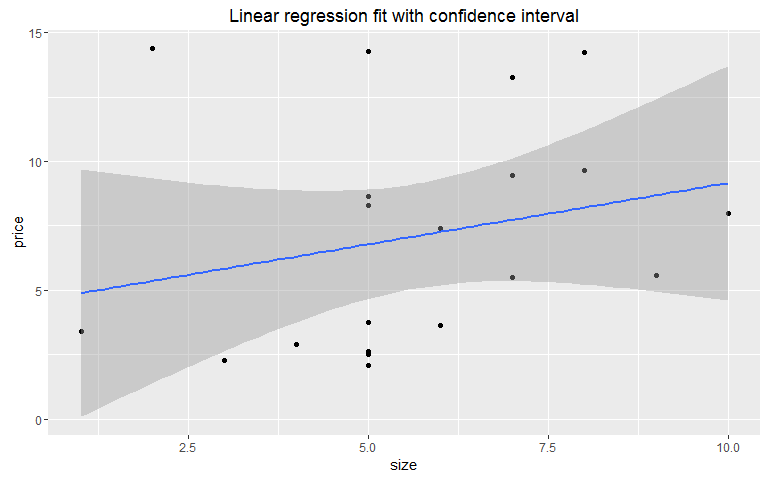

# R Tutorial
Andriy Zhubryd  
21 ÄŤervna 2016  

# Start with R
## Introduction

R is one of the most popular languages of statistical programming. It means that it cannot be used for development of end-to-end standalone applications (unlike python) and it's focused on statistical computations. This computational aspect can be seen everywhere: from data types to main functions and variables. After all, R console is designed to receive commands one-by-one, not the code of whole application in the beginning.

## Data types

To understant how R works, we should start with the main data types available:

* Elementary: numeric, character, date, boolean. Those are the basic one-element data types, available with the same qualities in every programming language.

* Vector: vectors of elementary variables. Widely used in R, a lot of functions are vector-oriented, meaning that they process vector as a whole, not an element separately.

* Factor: factor is the special case of vector, implemented in R. It's used for character vectors and idea behind is to extract distinct value from vector (so-called `levels`) store character vactor as vector of integers (number of level of this value) and levels. Factors are very suitable for grouping/regrouping both categorical and numerical variables and for usage in modelling.

* Matrix, array: matrix and n-dimensional arrays are the extensions of vector in multiple dimensions.

* Data Frame: usual table of data, where rows are cases and attributes. Analog of table of relative databases. Probably the main variable in R, used in storing, processing, import & export operations.

* List: collection of other variables. Is suitable for grouping related variables or complex objects (e.g. model). Elements of list can be of different type (e.g. data frame, elementary, vector).

## Simple operations

Now that we know the data types, we can look at the simple operations in R. They will be provided with comments so that you can better understand their function:

1. Elementary variables


```r
# Numeric
a <- 5 # or a = 5
a
```

```
## [1] 5
```

```r
class(a) # type - numeric
```

```
## [1] "numeric"
```

```r
# Character
string <- "You are a good strudent"
string
```

```
## [1] "You are a good strudent"
```

```r
class(string)
```

```
## [1] "character"
```

```r
# Boolean
b <- 1 == 2
b
```

```
## [1] FALSE
```

```r
class(b)
```

```
## [1] "logical"
```

```r
# Date
d <- Sys.Date()
d
```

```
## [1] "2016-06-22"
```

```r
class(d)
```

```
## [1] "Date"
```

2. Vector


```r
v <- c(1,2,3,4,5)
v
```

```
## [1] 1 2 3 4 5
```

```r
class(v) # class of elements
```

```
## [1] "numeric"
```

```r
is.vector(v)
```

```
## [1] TRUE
```

```r
v2 <- c(TRUE, FALSE, 5, 10)
v2 # numeric can fit boolean, but boolean cannot fit numeric like 5. Therefore, it will be saved as numeric - maximum of individual complexities.
```

```
## [1]  1  0  5 10
```

```r
class(v2)
```

```
## [1] "numeric"
```

```r
v3 <- c(TRUE, 5, "R")
v3
```

```
## [1] "TRUE" "5"    "R"
```

```r
class(v3) # character "R" has the highest complexity
```

```
## [1] "character"
```

```r
# Subsetting elements from vector
v[1] # first element
```

```
## [1] 1
```

```r
v[-2] # whole vector except element #2
```

```
## [1] 1 3 4 5
```

```r
v[c(1,3,5)] # elements #1,3,5
```

```
## [1] 1 3 5
```

```r
# Sorting vector
sort(v2) # sorted vector
```

```
## [1]  0  1  5 10
```

```r
order(v2) # which order (ascending) have elements in current sequence
```

```
## [1] 2 1 3 4
```

3. Factor


```r
f <- factor(c("M","M","M","F","F","F"))
str(f) # How is stored: levels and numeric vector
```

```
##  Factor w/ 2 levels "F","M": 2 2 2 1 1 1
```

```r
levels(f) # levels of factor
```

```
## [1] "F" "M"
```

```r
as.numeric(f) # numeric vector of factor
```

```
## [1] 2 2 2 1 1 1
```

```r
f
```

```
## [1] M M M F F F
## Levels: F M
```

```r
# Checking data type
class(f)
```

```
## [1] "factor"
```

```r
is.factor(f)
```

```
## [1] TRUE
```

4. Matrix, array


```r
# Matrix
M <- matrix(1:16, nrow = 4, ncol = 4)
M
```

```
##      [,1] [,2] [,3] [,4]
## [1,]    1    5    9   13
## [2,]    2    6   10   14
## [3,]    3    7   11   15
## [4,]    4    8   12   16
```

```r
# Checking data type
is.vector(M)
```

```
## [1] FALSE
```

```r
is.matrix(M)
```

```
## [1] TRUE
```

```r
is.array(M) # Matrix is subtype of array with 2 dimensions
```

```
## [1] TRUE
```

```r
class(M)
```

```
## [1] "matrix"
```

```r
M[1,3] # Extracting exact element
```

```
## [1] 9
```

```r
# array
A <- array(1:120, dim = 5:2)
A # 4-dimensional array
```

```
## , , 1, 1
## 
##      [,1] [,2] [,3] [,4]
## [1,]    1    6   11   16
## [2,]    2    7   12   17
## [3,]    3    8   13   18
## [4,]    4    9   14   19
## [5,]    5   10   15   20
## 
## , , 2, 1
## 
##      [,1] [,2] [,3] [,4]
## [1,]   21   26   31   36
## [2,]   22   27   32   37
## [3,]   23   28   33   38
## [4,]   24   29   34   39
## [5,]   25   30   35   40
## 
## , , 3, 1
## 
##      [,1] [,2] [,3] [,4]
## [1,]   41   46   51   56
## [2,]   42   47   52   57
## [3,]   43   48   53   58
## [4,]   44   49   54   59
## [5,]   45   50   55   60
## 
## , , 1, 2
## 
##      [,1] [,2] [,3] [,4]
## [1,]   61   66   71   76
## [2,]   62   67   72   77
## [3,]   63   68   73   78
## [4,]   64   69   74   79
## [5,]   65   70   75   80
## 
## , , 2, 2
## 
##      [,1] [,2] [,3] [,4]
## [1,]   81   86   91   96
## [2,]   82   87   92   97
## [3,]   83   88   93   98
## [4,]   84   89   94   99
## [5,]   85   90   95  100
## 
## , , 3, 2
## 
##      [,1] [,2] [,3] [,4]
## [1,]  101  106  111  116
## [2,]  102  107  112  117
## [3,]  103  108  113  118
## [4,]  104  109  114  119
## [5,]  105  110  115  120
```

```r
class(A)
```

```
## [1] "array"
```

```r
is.vector(A)
```

```
## [1] FALSE
```

```r
is.matrix(A)
```

```
## [1] FALSE
```

```r
is.array(A)
```

```
## [1] TRUE
```

```r
dim(A) # size of A (instances in each dimension)
```

```
## [1] 5 4 3 2
```

```r
length(dim(A)) # number of dimensions
```

```
## [1] 4
```

```r
A[2,1,2,1] # Extracting exact element
```

```
## [1] 22
```

5. Data frame


```r
df <- data.frame(size = c(1,4,7,3), price = c(2,6,4,2), type = factor(c("New", "Old", "New", "New")))
df
```

```
##   size price type
## 1    1     2  New
## 2    4     6  Old
## 3    7     4  New
## 4    3     2  New
```

```r
str(df) # structure of data.frame
```

```
## 'data.frame':	4 obs. of  3 variables:
##  $ size : num  1 4 7 3
##  $ price: num  2 6 4 2
##  $ type : Factor w/ 2 levels "New","Old": 1 2 1 1
```

```r
# Check data type
class(df)
```

```
## [1] "data.frame"
```

```r
is.matrix(df)
```

```
## [1] FALSE
```

```r
is.data.frame(df)
```

```
## [1] TRUE
```

```r
df$type # Extracting column
```

```
## [1] New Old New New
## Levels: New Old
```

```r
df$type[2] # Extracting exact element
```

```
## [1] Old
## Levels: New Old
```

```r
names(df) # names of columns
```

```
## [1] "size"  "price" "type"
```

6. List


```r
l <- list(f = f, df = df, v2 = v2, b = b)
l
```

```
## $f
## [1] M M M F F F
## Levels: F M
## 
## $df
##   size price type
## 1    1     2  New
## 2    4     6  Old
## 3    7     4  New
## 4    3     2  New
## 
## $v2
## [1]  1  0  5 10
## 
## $b
## [1] FALSE
```

```r
str(l)
```

```
## List of 4
##  $ f : Factor w/ 2 levels "F","M": 2 2 2 1 1 1
##  $ df:'data.frame':	4 obs. of  3 variables:
##   ..$ size : num [1:4] 1 4 7 3
##   ..$ price: num [1:4] 2 6 4 2
##   ..$ type : Factor w/ 2 levels "New","Old": 1 2 1 1
##  $ v2: num [1:4] 1 0 5 10
##  $ b : logi FALSE
```

```r
# Checking data type
class(l)
```

```
## [1] "list"
```

```r
is.list(l)
```

```
## [1] TRUE
```

```r
names(l) # names of elements
```

```
## [1] "f"  "df" "v2" "b"
```

```r
l$f # extracting element of list
```

```
## [1] M M M F F F
## Levels: F M
```

```r
l$df$price # column of element of list
```

```
## [1] 2 6 4 2
```

```r
l[[1]] # first element of list
```

```
## [1] M M M F F F
## Levels: F M
```

## Import

As usual, first step of data processing in R is importing the data. Data can be in various forms and locations, but the most basic one is a text file (usually `*.csv`) on the local hard drive:


```r
dt_total <- read.csv("D:/OneDrive/VSE/II/R Tutorial/Data/dt_total.csv")
dt_pyramid <- read.csv("D:/OneDrive/VSE/II/R Tutorial/Data/dt_pyramid.csv", header = T, sep = ",", quote = '"', stringsAsFactors = T)

class(dt_total)
```

```
## [1] "data.frame"
```

```r
str(dt_total)
```

```
## 'data.frame':	9744 obs. of  6 variables:
##  $ X         : int  1 2 3 4 5 6 7 8 9 10 ...
##  $ Age       : Factor w/ 1 level "TOTAL": 1 1 1 1 1 1 1 1 1 1 ...
##  $ Sex       : Factor w/ 3 levels "F","M","T": 1 1 1 1 1 1 1 1 1 1 ...
##  $ Geo       : Factor w/ 58 levels "AD","AL","AM",..: 1 2 3 4 5 6 7 8 9 31 ...
##  $ Year      : int  2015 2015 2015 2015 2015 2015 2015 2015 2015 2015 ...
##  $ Population: num  NA 1431000 NA 4381296 NA ...
```

```r
head(dt_total, 10)
```

```
##     X   Age Sex Geo Year Population
## 1   1 TOTAL   F  AD 2015         NA
## 2   2 TOTAL   F  AL 2015    1431000
## 3   3 TOTAL   F  AM 2015         NA
## 4   4 TOTAL   F  AT 2015    4381296
## 5   5 TOTAL   F  AZ 2015         NA
## 6   6 TOTAL   F  BA 2015         NA
## 7   7 TOTAL   F  BE 2015    5722178
## 8   8 TOTAL   F  BG 2015    3700183
## 9   9 TOTAL   F  BY 2015         NA
## 10 10 TOTAL   F  CH 2015    4163786
```

Also, you may face the problem to upload data in some specific format: matlab, fortran, JSON, Excel sheet, ODBC, etc. For these cases exist special libraries, which you can find [here](http://cran.r-project.org/web/packages/available_packages_by_name.html).

## Chain operator

One of very useful operators in R, which I use quite ofter, is element `%>%`. It is called chaining operator and is a part of *dplyr* package. This operator is handing element on the left to the function on the right as the first argument. It helps to make complicated nested formulas easier to comprehend:


```r
# Simple example
    filter(dataset, field == "value") 
        # is equal to
    dataset %>% filter(field == "value")

# More complex example
    summarize(group_by(filter(dataset, field == "value"), group_field), function(value_field))
        # is equal to
    dataset %>% filter(field == "value") %>% group_by(group_field) %>% summarize(function(value_field))
```

As you can see from the second example, chaining operator makes your code much more easier to read. That's why it's used throughout the paper.

# Data transformation

After mastering the basics, you should switch to serious step: data transformation and analysis. This section will review main points on how to work with data in R.

## Binding

Binding is the simplest way how to unite few datasets, add a row, etc.:

```r
rbind(c(1,2,3,4), c(10,9,8,7)) # binding 2 rows
```

```
##      [,1] [,2] [,3] [,4]
## [1,]    1    2    3    4
## [2,]   10    9    8    7
```

```r
cbind(c(1,2,3,4), c(2,4,1,1)) # binding 2 columns
```

```
##      [,1] [,2]
## [1,]    1    2
## [2,]    2    4
## [3,]    3    1
## [4,]    4    1
```

## dplyr

*dplyr* is a special package (one of few), dedicated to data transformation. Operatios, available in dplyr can be compared with SQL: select, group_by, etc.:


```r
library(dplyr)
```

```
## 
## Attaching package: 'dplyr'
```

```
## The following objects are masked from 'package:stats':
## 
##     filter, lag
```

```
## The following objects are masked from 'package:base':
## 
##     intersect, setdiff, setequal, union
```

```r
dt_total %>% filter(Geo == "DE_TOT" & Year == 2013) # Filtering
```

```
##     X   Age Sex    Geo Year Population
## 1 362 TOTAL   F DE_TOT 2013   41673725
## 2 420 TOTAL   M DE_TOT 2013   40346853
## 3 478 TOTAL   T DE_TOT 2013   82020578
```

```r
dt_total %>% group_by(Year) %>% summarize(Total_Population = sum(Population, na.rm = T)) %>% head() # Grouping
```

```
## Source: local data frame [6 x 2]
## 
##    Year Total_Population
##   (int)            (dbl)
## 1  1960       2877397993
## 2  1961        970707037
## 3  1962        961960168
## 4  1963        973081739
## 5  1964        982880840
## 6  1965       3014277242
```

```r
dt_total %>% mutate(Pop_mln = Population/10^6) %>% head() # Changing columns
```

```
##   X   Age Sex Geo Year Population  Pop_mln
## 1 1 TOTAL   F  AD 2015         NA       NA
## 2 2 TOTAL   F  AL 2015    1431000 1.431000
## 3 3 TOTAL   F  AM 2015         NA       NA
## 4 4 TOTAL   F  AT 2015    4381296 4.381296
## 5 5 TOTAL   F  AZ 2015         NA       NA
## 6 6 TOTAL   F  BA 2015         NA       NA
```

## Merging

Merging is another analogy from the SQL and it corresponds to JOIN (INNER, LEFT) command:


```r
df
```

```
##   size price type
## 1    1     2  New
## 2    4     6  Old
## 3    7     4  New
## 4    3     2  New
```

```r
sizes <- data.frame(size = c(1, 4, 7, 10),  description = c("small", "medium", "big", "huge"))
sizes
```

```
##   size description
## 1    1       small
## 2    4      medium
## 3    7         big
## 4   10        huge
```

```r
# Merge df and sizes to add column description to the df
merge(df, sizes, by = "size") # INNER JOIN
```

```
##   size price type description
## 1    1     2  New       small
## 2    4     6  Old      medium
## 3    7     4  New         big
```

```r
merge(df, sizes, by = "size", all = T) # FULL JOIN
```

```
##   size price type description
## 1    1     2  New       small
## 2    3     2  New        <NA>
## 3    4     6  Old      medium
## 4    7     4  New         big
## 5   10    NA <NA>        huge
```

```r
merge(df, sizes, by = "size", all.x = T) # LEFT JOIN
```

```
##   size price type description
## 1    1     2  New       small
## 2    3     2  New        <NA>
## 3    4     6  Old      medium
## 4    7     4  New         big
```

```r
merge(df, sizes, by = "size", all.y = T) # RIGHT JOIN
```

```
##   size price type description
## 1    1     2  New       small
## 2    4     6  Old      medium
## 3    7     4  New         big
## 4   10    NA <NA>        huge
```

Merge is quite important during various transformations of data. For example, to calculate age distribution of population:

```r
tmp_age <- dt_pyramid %>% filter(Year >= 2010 & Geo == "CZ") %>% 
  mutate(Population = F + M) %>% select(Age, Year,Population) %>%
  filter(!is.na(Population))
tmp_age %>% head()
```

```
##   Age Year Population
## 1   0 2010     119687
## 2   0 2011     119110
## 3   0 2012     108753
## 4   0 2013     108692
## 5   0 2014     106829
## 6   0 2015     109943
```

```r
total_population <- tmp_age %>% group_by(Year) %>% summarize(Total = sum(Population, na.rm = T))
total_population %>% head()
```

```
## Source: local data frame [6 x 2]
## 
##    Year    Total
##   (int)    (dbl)
## 1  2010 10462088
## 2  2011 10486731
## 3  2012 10505445
## 4  2013 10516125
## 5  2014 10512419
## 6  2015 10538275
```

```r
merge(tmp_age, total_population, by = "Year") %>% mutate(Share = Population/Total) %>% 
  arrange(Year, Age) %>% head()
```

```
##   Year Age Population    Total       Share
## 1 2010   0     119687 10462088 0.011440068
## 2 2010   1     121706 10462088 0.011633051
## 3 2010   2     117283 10462088 0.011210286
## 4 2010   3     108146 10462088 0.010336942
## 5 2010   4     102788 10462088 0.009824807
## 6 2010   5      98005 10462088 0.009367633
```

## Reproducibility

Advantage of R against, for instance, Excel is that user has to describe all hist actions with data in code and this code can be run on the other continent and still has same results in case of same imputs. This is reproducibility.

Reproducibility is very important for scientific data analyses and reseatch papers because it allows your opponent to make sure that your calculations are correct. Otherwise, credibility of your paper/research will fall immediately.

To gain reproducibility, you have to follow few main steps:

1. Do all data transformation in R. In case you do some quick and obvious data cleaning in Excel, it won't be in R code and you R code would yield different results from raw input data. Ideally, you shouldn't even download the file manually, but use direct links to the data sources in your R code.

2. Set seed: this is a randomizator setting. Setting seed will ensure you receive identically same results of random generation during the next run. Let's see it on the example:


```r
set.seed(1234)
r1 <- rnorm(10)
r2 <- rnorm(10)

set.seed(1235)
r3 <- rnorm(10)

set.seed(1234)
r4 <- rnorm(10)

cbind(r1, r2, r3, r4) # You can easily see that columns #1 and #4 appear similar
```

```
##               r1          r2          r3         r4
##  [1,] -1.2070657 -0.47719270 -0.69798794 -1.2070657
##  [2,]  0.2774292 -0.99838644 -1.28485386  0.2774292
##  [3,]  1.0844412 -0.77625389  0.98995901  1.0844412
##  [4,] -2.3456977  0.06445882  0.11177583 -2.3456977
##  [5,]  0.4291247  0.95949406  0.11420767  0.4291247
##  [6,]  0.5060559 -0.11028549  1.69819652  0.5060559
##  [7,] -0.5747400 -0.51100951  0.04784562 -0.5747400
##  [8,] -0.5466319 -0.91119542  0.65486241 -0.5466319
##  [9,] -0.5644520 -0.83717168  1.36528367 -0.5644520
## [10,] -0.8900378  2.41583518  0.40257296 -0.8900378
```

```r
# Detailed check
r1 == r4 # this means that columns are the same
```

```
##  [1] TRUE TRUE TRUE TRUE TRUE TRUE TRUE TRUE TRUE TRUE
```

```r
r1 == r3 # all pairs of values are different
```

```
##  [1] FALSE FALSE FALSE FALSE FALSE FALSE FALSE FALSE FALSE FALSE
```

```r
r1 == r2 # different
```

```
##  [1] FALSE FALSE FALSE FALSE FALSE FALSE FALSE FALSE FALSE FALSE
```

```r
all.equal(r1, r4) # another way to check
```

```
## [1] TRUE
```

## Functions

Next important step for user in R is to create his/her own functions. Functions are easy and they allow to make your code more efficient and ogranized by coding into functions repeating chunks of code.

One of good examples of function would be to calculate some index. Let's take as an example index of masculinity:


```r
Masculinity_elementary <- function(M, F) M/F # Very easy form of function

Masculinity_elementary(100, 103) # Easy
```

```
## [1] 0.9708738
```

```r
Masculinity_elementary(c(100, 89, 103), c(103, 180, 50)) 
```

```
## [1] 0.9708738 0.4944444 2.0600000
```

As we see, if we apply it on the vectors, it will be calculated on each pair of `M` and `F` separately and output will be vector. Let's build another function that will calculated total index of masculinity for vector input:


```r
Masculinity_vector <- function(M, F) sum(M)/sum(F)

Masculinity_vector(100, 103) # Still works nice
```

```
## [1] 0.9708738
```

```r
Masculinity_vector(c(100, 89, 103), c(103, 180, 50)) # Now it works
```

```
## [1] 0.8768769
```

Now it works fine with both vectors and elementary values. What about situation when you have dataframe with 2 columns: Sex and Population. In this case you would have to split it somehow before applying our function. Also, you can use your previously created functions in the new ones:


```r
df <- data.frame(Sex = factor(c("M","M","M","F","F","F")), Population = c(100, 89, 103, 103, 180, 50))
df
```

```
##   Sex Population
## 1   M        100
## 2   M         89
## 3   M        103
## 4   F        103
## 5   F        180
## 6   F         50
```

```r
Masculinity_dataframe <- function(data) Masculinity_vector(df$Population[df$Sex == "M"], df$Population[df$Sex == "F"])

Masculinity_dataframe(df)
```

```
## [1] 0.8768769
```

## Apply

There is so-called `apply` family of functions in R. Their point is to take some iterable object (e.g. vector, matrix, list, dataframe) and apply some function on each separated element (can be non-elementary element, e.g. vector). There are following functions in the family:

1. sapply: target is vector, applying function for each element of vector

2. lapply: target is list, applying function for each element of vector

3. apply: target is array (matrix, dataframe), applying for each cut (row or column)

4. mapply: targets are vectors, which are the arguments of one function

Let's see them in action:

```r
# sapply
v
```

```
## [1] 1 2 3 4 5
```

```r
sapply(v, sqrt) # Take square root of each element
```

```
## [1] 1.000000 1.414214 1.732051 2.000000 2.236068
```

```r
sqrt(v) # Luckily, function `sqrt` is adapted for usage on vectors
```

```
## [1] 1.000000 1.414214 1.732051 2.000000 2.236068
```

```r
# lapply
str(l)
```

```
## List of 4
##  $ f : Factor w/ 2 levels "F","M": 2 2 2 1 1 1
##  $ df:'data.frame':	4 obs. of  3 variables:
##   ..$ size : num [1:4] 1 4 7 3
##   ..$ price: num [1:4] 2 6 4 2
##   ..$ type : Factor w/ 2 levels "New","Old": 1 2 1 1
##  $ v2: num [1:4] 1 0 5 10
##  $ b : logi FALSE
```

```r
lapply(l, class) # type of each object in the list
```

```
## $f
## [1] "factor"
## 
## $df
## [1] "data.frame"
## 
## $v2
## [1] "numeric"
## 
## $b
## [1] "logical"
```

```r
lapply(l, dim) # dimensions of each element of the list
```

```
## $f
## NULL
## 
## $df
## [1] 4 3
## 
## $v2
## NULL
## 
## $b
## NULL
```

```r
lapply(l, names) # names of columns of elements of the list
```

```
## $f
## NULL
## 
## $df
## [1] "size"  "price" "type" 
## 
## $v2
## NULL
## 
## $b
## NULL
```

```r
# apply
M
```

```
##      [,1] [,2] [,3] [,4]
## [1,]    1    5    9   13
## [2,]    2    6   10   14
## [3,]    3    7   11   15
## [4,]    4    8   12   16
```

```r
apply(M, MARGIN = 1, mean) # means of custs by 1-st dimensions (average of each row)
```

```
## [1]  7  8  9 10
```

```r
rowMeans(M) # same as our `apply` formula
```

```
## [1]  7  8  9 10
```

```r
apply(M, MARGIN = 2, mean) # means by 2nd dimension (average of each column)
```

```
## [1]  2.5  6.5 10.5 14.5
```

```r
colMeans(M) # same
```

```
## [1]  2.5  6.5 10.5 14.5
```

```r
# mapply
mapply(FUN = function(x,y) x*y, x = 1:4, y = 2:-1) # mutliplying corresponding elements: 1*2, 2*1, 3*0, 4*(-1)
```

```
## [1]  2  2  0 -4
```


# Data visualization

## Base

After data analysis and transformation comes data visualization to really see what your numbers are. The most elementary graphics is provided in the package `base`, but it's not very flexible and estetic. It's super-easy and intuitive, but it won't satisfy you for long:


```r
set.seed(20)
x <- rnorm(10)
y <- runif(10)

plot(x, y, main = "Simple plot")
```

<!-- -->

```r
plot(x, y, type = "b", main = "Plot with both lines and point")
abline(h = .5, col = "red")
abline(v = 0, col = "red")
```

<!-- -->

R has 2 advanced widely used graphic libraries: `ggplot2` and `lattice`. My personal favourite is `ggplot2`, so we'll look in more detail at it in the following section.

## ggplot2

Library `ggplot2` was created based on book 'Grammar of Graphics' and is supposed to make your chart building like creating a sentence. It's very powerful and flexible, but sometimes not easy to find solution on your own. Luckily, internet is full of documentation, tutorials and examples of ggplot and, from my own experience, you can always find an answer to your question.

So let's start with examples of ggplot's possibilities:


```r
library(ggplot2)
df <- data.frame(size = sample(1:10, 20, T), price = runif(20, min = 2, max = 15), type = factor(sample(c("New","Old"), 20, T)))
df
```

```
##    size     price type
## 1     4  2.916525  New
## 2     5  8.297699  New
## 3     9  5.581946  New
## 4     2 14.387417  Old
## 5     6  3.634786  Old
## 6     5  8.637587  New
## 7     5  2.086692  Old
## 8    10  7.985130  New
## 9     7  5.507011  Old
## 10    3  2.289286  New
## 11    6  7.386842  New
## 12    1  3.401431  Old
## 13    5 14.273287  New
## 14    5  2.628523  Old
## 15    8 14.222119  Old
## 16    5  2.515293  New
## 17    7 13.260164  New
## 18    8  9.667367  Old
## 19    5  3.771198  New
## 20    7  9.453297  New
```

```r
ggplot(data = df, mapping = aes(x = size, y = price)) + geom_point() + 
  ggtitle("Simple basic graph")
```

<!-- -->

As you can see, simple basic graph looks much better in `ggplot2`. Let's assume we need more details on the graph:


```r
# Adding 'type' on the plot
df %>% ggplot(aes(x = size, y = price, color = type)) + geom_point() # differentiation by type
```

<!-- -->

```r
df %>% ggplot(aes(x = size, y = price)) + geom_point() + facet_wrap(~type)  # differentiation by type | version 2
```

<!-- -->

```r
# Quick fitting of prediction models
df %>% ggplot(aes(x = size, y = price)) + geom_point() +
  stat_smooth(method = "lm") + ggtitle("Linear regression fit with confidence interval")
```

<!-- -->

```r
df %>% ggplot(aes(x = size, y = price)) + geom_point() +
  stat_smooth(method = "loess", se = F) + ggtitle("Loess fit")
```

<!-- -->

```r
df %>% ggplot(aes(x = size, y = price, color = type)) + geom_point() +
  stat_smooth(method = "lm", se = F) + 
ggtitle("Linear regression fit\ndifferentiation by type")
```

<!-- -->

You can see how quickly and nicely we can graphically fit different models or create mutliple graphs. Further, let's look what other could be done in ggplot with examples on real demographic data:


```r
# Adding generation columns to the dataset
dt_pyramid <- dt_pyramid %>% 
  mutate(Gen_bio = cut(Age, include.lowest = T, breaks = c(0, 15, 50, 100), right = F),
         Gen_eco = cut(Age, include.lowest = T, breaks = c(0, 20, 65, 100), right = F))
```

```
## Warning in if (right) "(" else "[": the condition has length > 1 and only
## the first element will be used
```

```
## Warning in if (right) "]" else ")": the condition has length > 1 and only
## the first element will be used
```

```
## Warning in if (right) substr(labels[1L], 1L, 1L) <- "[" else
## substring(labels[nb - : the condition has length > 1 and only the first
## element will be used
```

```
## Warning in if (right) "(" else "[": the condition has length > 1 and only
## the first element will be used
```

```
## Warning in if (right) "]" else ")": the condition has length > 1 and only
## the first element will be used
```

```
## Warning in if (right) substr(labels[1L], 1L, 1L) <- "[" else
## substring(labels[nb - : the condition has length > 1 and only the first
## element will be used
```

```r
tmp <- dt_pyramid %>% filter(Geo %in% c("CZ", "ES") & between(Year, 2000, 2010)) %>% 
  group_by(Gen_eco, Year, Geo) %>% summarize(Population = sum(F+M))
g <- tmp %>% group_by(Year, Geo) %>% summarize(Tot = sum(Population)) %>% merge(tmp) %>%
         mutate(Share = Population/Tot * 100) %>% arrange(Gen_eco) %>%
         ggplot(aes(x = Year, y = Share, color = Gen_eco, fill = Gen_eco)) + geom_area() +
         facet_wrap(~Geo) + ggtitle("Comparison of countries by economical generations")
g
```

<!-- -->

Our example is quite complex because it's, also, calculating distribution of population by economical generations in Czech Republic and Spain for period of 2000-2010. Further examples of `ggplot2` in Economic Demography will the in section 'Demography in R'.

## Interactive charts

Interactive plots are so much nicer and more interesting for us because we can find out more from them. R has few libraries for interactive plotting and the idea behind is that those plots are based on JavaScript and can be used in HTML reports and presentation. Let's have a quick look at each of the plotting libraries:

1. googleVis


```r
library(googleVis)
```

```
## 
## Welcome to googleVis version 0.5.10
## 
## Please read the Google API Terms of Use
## before you start using the package:
## https://developers.google.com/terms/
## 
## Note, the plot method of googleVis will by default use
## the standard browser to display its output.
## 
## See the googleVis package vignettes for more details,
## or visit http://github.com/mages/googleVis.
## 
## To suppress this message use:
## suppressPackageStartupMessages(library(googleVis))
```

```r
# Preparation of data: different ratios
library(reshape2) # for some data manipulation
Ratios <- dt_pyramid %>% 
       filter(Geo %in% c("CZ","ES","NO","SE","DE_TOT") & between(Year, 2000, 2010)) %>%
       group_by(Year, Geo) %>% summarize(Masculinity = sum(M)/sum(F))
     
     Ratios <- dt_pyramid %>% mutate(Tot = M + F) %>% group_by(Year, Geo, Gen_bio) %>% 
       summarize(Tot = sum(Tot)) %>% 
       dcast(Year + Geo ~ Gen_bio, value.var = "Tot", fun.aggregate = sum, na.rm = T) %>%
       setNames(c("Year", "Geo", "I", "II", "III")) %>% mutate(Sauvy = III/I) %>%
       select(Year, Geo, Sauvy) %>% merge(Ratios)
     
     Ratios <- dt_pyramid %>% mutate(Tot = M + F) %>% group_by(Year, Geo, Gen_eco) %>% 
       summarize(Tot = sum(Tot)) %>% 
       dcast(Year + Geo ~ Gen_eco, value.var = "Tot", fun.aggregate = sum, na.rm = T) %>%
       setNames(c("Year", "Geo", "I", "II", "III")) %>% 
       mutate(TDR = (I+III)/II, OADR = III/II, JADR = I/II, Seniority = III/I) %>% 
       select(-I,-II,-III) %>% merge(Ratios)

head(Ratios)
```

```
##   Year    Geo       TDR      OADR      JADR Seniority    Sauvy Masculinity
## 1 2000     CZ 0.5926929 0.2197452 0.3729477 0.5892119 1.922285   0.9477028
## 2 2000 DE_TOT 0.6021861 0.2603491 0.3418370 0.7616179 2.242479   0.9528929
## 3 2000     ES 0.6208032 0.2713746 0.3494286 0.7766238 2.197109   0.9590972
## 4 2000     NO 0.6993885 0.2591800 0.4402085 0.5887664 1.571069   0.9804467
## 5 2000     SE 0.7092224 0.2956045 0.4136179 0.7146801 1.935546   0.9774195
## 6 2001     CZ 0.5805136 0.2178981 0.3626155 0.6009066 2.002396   0.9490812
```


```r
M <- gvisMotionChart(Ratios, idvar = "Geo", timevar = "Year", options = list(width = 550, height = 450), chartid = "chartid")
print(M, 'chart')
```

<!-- MotionChart generated in R 3.3.0 by googleVis 0.5.10 package -->
<!-- Wed Jun 22 12:24:29 2016 -->


<!-- jsHeader -->
<script type="text/javascript">
 
// jsData 
function gvisDatachartid () {
var data = new google.visualization.DataTable();
var datajson =
[
 [
 "CZ",
2000,
0.5926928976,
0.2197452057,
0.3729476919,
0.5892118665,
1.92228467,
0.9477028392 
],
[
 "DE_TOT",
2000,
0.6021861155,
0.2603491464,
0.3418369691,
0.7616178761,
2.242479383,
0.9528928962 
],
[
 "ES",
2000,
0.6208031869,
0.2713745737,
0.3494286131,
0.7766237897,
2.197109257,
0.9590971769 
],
[
 "NO",
2000,
0.6993884702,
0.2591799672,
0.440208503,
0.588766381,
1.571068841,
0.9804466964 
],
[
 "SE",
2000,
0.7092224135,
0.2956044948,
0.4136179187,
0.7146800983,
1.935546176,
0.9774195391 
],
[
 "CZ",
2001,
0.58051361,
0.2178980646,
0.3626155454,
0.6009065726,
2.002395851,
0.9490811512 
],
[
 "DE_TOT",
2001,
0.6073897509,
0.267587416,
0.3398023349,
0.7874796273,
2.290492659,
0.9537689045 
],
[
 "ES",
2001,
0.6103167198,
0.2720477985,
0.3382689214,
0.8042352734,
2.240344793,
0.9605346047 
],
[
 "NO",
2001,
0.6954309867,
0.2555610061,
0.4398699806,
0.5809921507,
1.577441378,
0.9820283566 
],
[
 "SE",
2001,
0.7041239307,
0.2936938264,
0.4104301042,
0.7155757421,
1.966223285,
0.9783329276 
],
[
 "CZ",
2002,
0.5708186189,
0.2177955592,
0.3530230597,
0.616944285,
2.092855997,
0.9484004912 
],
[
 "DE_TOT",
2002,
0.6128361912,
0.2751773468,
0.3376588444,
0.8149567272,
2.346381016,
0.9551540706 
],
[
 "ES",
2002,
0.6003942945,
0.27224455,
0.3281497446,
0.8296351117,
2.267295869,
0.9615564313 
],
[
 "NO",
2002,
0.6920353572,
0.2527622336,
0.4392731236,
0.5754101948,
1.588724484,
0.9823857691 
],
[
 "SE",
2002,
0.7009527795,
0.2925054527,
0.4084473268,
0.7161399612,
1.996096959,
0.9795057772 
],
[
 "CZ",
2003,
0.5616720042,
0.2172087381,
0.3444632661,
0.6305715571,
2.17470581,
0.948527323 
],
[
 "DE_TOT",
2003,
0.6180856477,
0.2830650057,
0.335020642,
0.8449181041,
2.412537956,
0.9562255709 
],
[
 "ES",
2003,
0.5916413467,
0.2698981434,
0.3217432033,
0.8388619886,
2.27366865,
0.9650979069 
],
[
 "NO",
2003,
0.6883529382,
0.2498178964,
0.4385350418,
0.5696646166,
1.601899535,
0.9825629479 
],
[
 "SE",
2003,
0.6988516851,
0.2914385421,
0.4074131429,
0.7153390783,
2.023377018,
0.9808196459 
],
[
 "CZ",
2004,
0.5533612863,
0.2167729884,
0.3365882979,
0.6440300801,
2.259999961,
0.9500664186 
],
[
 "DE_TOT",
2004,
0.6256836947,
0.2927076513,
0.3329760434,
0.8790651973,
2.489225225,
0.9568556099 
],
[
 "ES",
2004,
0.5832241197,
0.26593351,
0.3172906097,
0.8381386081,
2.274287936,
0.9677056343 
],
[
 "NO",
2004,
0.6873912079,
0.2485894346,
0.4388017733,
0.5665187557,
1.624039028,
0.9829497212 
],
[
 "SE",
2004,
0.6992532931,
0.2917866783,
0.4074666148,
0.7160995962,
2.058157962,
0.981815468 
],
[
 "CZ",
2005,
0.5472413685,
0.2175680764,
0.3296732921,
0.659950568,
2.337955957,
0.9507396333 
],
[
 "DE_TOT",
2005,
0.6362438645,
0.3047834988,
0.3314603657,
0.919517174,
2.569625141,
0.9574445262 
],
[
 "ES",
2005,
0.5724947622,
0.2604055113,
0.3120892509,
0.8343943619,
2.281995649,
0.9715057353 
],
[
 "NO",
2005,
0.6871381784,
0.2482234436,
0.4389147348,
0.5655390988,
1.65067886,
0.9835408366 
],
[
 "SE",
2005,
0.7006544338,
0.2933383332,
0.4073161006,
0.7201736755,
2.095940151,
0.9826691758 
],
[
 "CZ",
2006,
0.5432084547,
0.219763697,
0.3234447577,
0.6794473918,
2.415387904,
0.9533289071 
],
[
 "DE_TOT",
2006,
0.6460518156,
0.3168801488,
0.3291716668,
0.9626592467,
2.662099893,
0.9582385961 
],
[
 "ES",
2006,
0.571977695,
0.2616088361,
0.3103688589,
0.8428965363,
2.283192987,
0.9743688532 
],
[
 "NO",
2006,
0.6862706976,
0.2480114574,
0.4382592403,
0.5659012625,
1.681388955,
0.9844938796 
],
[
 "SE",
2006,
0.6996768309,
0.294065865,
0.4056109658,
0.7249948591,
2.145060534,
0.9836332616 
],
[
 "CZ",
2007,
0.5411982356,
0.222750539,
0.3184476966,
0.6994886172,
2.488625206,
0.9555570007 
],
[
 "DE_TOT",
2007,
0.6525153123,
0.3272168549,
0.3252984574,
1.005897346,
2.745469291,
0.9592377636 
],
[
 "ES",
2007,
0.5687299025,
0.2594601231,
0.3092697794,
0.8389443145,
2.28026737,
0.9758792254 
],
[
 "NO",
2007,
0.6830523173,
0.2464991644,
0.4365531529,
0.5646486867,
1.710856566,
0.987450676 
],
[
 "SE",
2007,
0.6994383788,
0.2949060617,
0.404532317,
0.7290049504,
2.181509009,
0.9855741095 
],
[
 "CZ",
2008,
0.5396554129,
0.2251593515,
0.3144960614,
0.7159369516,
2.528288664,
0.9596105189 
],
[
 "DE_TOT",
2008,
0.6518086103,
0.3318720677,
0.3199365425,
1.037305914,
2.82169516,
0.9602023863 
],
[
 "ES",
2008,
0.5661154226,
0.2574117783,
0.3087036443,
0.8338475525,
2.278844141,
0.9789416563 
],
[
 "NO",
2008,
0.6793018015,
0.2457739806,
0.4335278209,
0.5669162825,
1.735306273,
0.9925168697 
],
[
 "SE",
2008,
0.7018805346,
0.2980887005,
0.4037918341,
0.7382236969,
2.213210718,
0.988074274 
],
[
 "CZ",
2009,
0.5422345263,
0.2302230118,
0.3120115145,
0.7378670374,
2.548482186,
0.9637552846 
],
[
 "DE_TOT",
2009,
0.6514551409,
0.3369075703,
0.3145475706,
1.071086226,
2.893987273,
0.960931007 
],
[
 "ES",
2009,
0.570487128,
0.2600979512,
0.3103891768,
0.8379736491,
2.276320121,
0.9795277904 
],
[
 "NO",
2009,
0.6762959263,
0.2461786721,
0.4301172542,
0.5723524683,
1.754581152,
0.9961958224 
],
[
 "SE",
2009,
0.7054669812,
0.3031035166,
0.4023634646,
0.7533077511,
2.232178122,
0.9894840281 
],
[
 "CZ",
2010,
0.5483921765,
0.236729442,
0.3116627345,
0.7595692899,
2.535968887,
0.9643712394 
],
[
 "DE_TOT",
2010,
0.6505432145,
0.3410303896,
0.3095128249,
1.101829592,
2.965394206,
0.9617482829 
],
[
 "ES",
2010,
0.576988788,
0.2649560991,
0.312032689,
0.8491293011,
2.290784279,
0.9777881513 
],
[
 "NO",
2010,
0.6776887245,
0.2495616881,
0.4281270364,
0.582915039,
1.773591217,
0.9980690511 
],
[
 "SE",
2010,
0.7101431179,
0.3095566952,
0.4005864227,
0.7727588295,
2.243854239,
0.9909085639 
] 
];
data.addColumn('string','Geo');
data.addColumn('number','Year');
data.addColumn('number','TDR');
data.addColumn('number','OADR');
data.addColumn('number','JADR');
data.addColumn('number','Seniority');
data.addColumn('number','Sauvy');
data.addColumn('number','Masculinity');
data.addRows(datajson);
return(data);
}
 
// jsDrawChart
function drawChartchartid() {
var data = gvisDatachartid();
var options = {};
options["width"] =    550;
options["height"] =    450;
options["state"] = "";

    var chart = new google.visualization.MotionChart(
    document.getElementById('chartid')
    );
    chart.draw(data,options);
    

}
  
 
// jsDisplayChart
(function() {
var pkgs = window.__gvisPackages = window.__gvisPackages || [];
var callbacks = window.__gvisCallbacks = window.__gvisCallbacks || [];
var chartid = "motionchart";
  
// Manually see if chartid is in pkgs (not all browsers support Array.indexOf)
var i, newPackage = true;
for (i = 0; newPackage && i < pkgs.length; i++) {
if (pkgs[i] === chartid)
newPackage = false;
}
if (newPackage)
  pkgs.push(chartid);
  
// Add the drawChart function to the global list of callbacks
callbacks.push(drawChartchartid);
})();
function displayChartchartid() {
  var pkgs = window.__gvisPackages = window.__gvisPackages || [];
  var callbacks = window.__gvisCallbacks = window.__gvisCallbacks || [];
  window.clearTimeout(window.__gvisLoad);
  // The timeout is set to 100 because otherwise the container div we are
  // targeting might not be part of the document yet
  window.__gvisLoad = setTimeout(function() {
  var pkgCount = pkgs.length;
  google.load("visualization", "1", { packages:pkgs, callback: function() {
  if (pkgCount != pkgs.length) {
  // Race condition where another setTimeout call snuck in after us; if
  // that call added a package, we must not shift its callback
  return;
}
while (callbacks.length > 0)
callbacks.shift()();
} });
}, 100);
}
 
// jsFooter
</script>
 
<!-- jsChart -->  
<script type="text/javascript" src="https://www.google.com/jsapi?callback=displayChartchartid"></script>
 
<!-- divChart -->
  
<div id="chartid" 
  style="width: 550; height: 450;">
</div>

2. rCharts


```r
library(rCharts)
```

# Demography in R
## Pyramid

First need of specific packages for demography comes with plotting the pyramid chart. There is a special package called `pyramid` for that kind of a plot. Here's how it can be applied:


```r
# Special package
library(pyramid)
dt_pyramid %>% filter(Geo == "CZ" & Year == 2000) %>% select(M, F, Age) %>%
  pyramid(Csize = 1, Cstep = 5, AxisFM = 'd', Cgap = .1, Laxis = 0:4*25000,
          main = "Pyramid of Czech population in 2000")
```

<!-- -->

```r
# Usual ggplot
library(scales) # library for numeric formatting
tmp_pyr <- dt_pyramid %>% filter(Geo %in% c("CZ","BE") & Year %in% c(2000, 2010)) %>%
  select(-X, -Gen_bio, -Gen_eco) %>% melt(id = c("Age", "Geo", "Year")) %>%
  mutate(Sex = variable, Population = value)
ggplot(data = tmp_pyr, aes(x = Age, y = Population, fill = Sex)) + 
  geom_bar(data = subset(tmp_pyr, Sex == "F"), stat = "identity") + 
  geom_bar(data = subset(tmp_pyr, Sex == "M"), aes(y=-Population), stat = "identity") + 
  scale_y_continuous(labels = function(x) comma(abs(x))) + 
  coord_flip() + ggtitle("Pyramid graphs of selected years and countries") +
  scale_fill_brewer(palette = "Set1") +
  facet_grid(Geo ~ Year) + theme_bw()
```

```
## Warning: Stacking not well defined when ymin != 0
```

<!-- -->

```r
# ggplot with 5-year grouping
tmp_pyr <- dt_pyramid %>% filter(Geo %in% c("CZ","BE") & Year %in% c(2000, 2010)) %>%
  select(-X, -Gen_bio, -Gen_eco) %>% melt(id = c("Age", "Geo", "Year")) %>%
  mutate(Sex = variable, Population = value, Age = Age - Age %% 5) %>% group_by(Age, Geo, Year, Sex) %>% summarize(Population = sum(Population))
ggplot(data = tmp_pyr, aes(x = Age, y = Population, fill = Sex)) + 
  geom_bar(data = subset(tmp_pyr, Sex == "F"), stat = "identity") + 
  geom_bar(data = subset(tmp_pyr, Sex == "M"), aes(y=-Population), stat = "identity") + 
  scale_y_continuous(labels = function(x) comma(abs(x))) + 
  coord_flip() + ggtitle("Pyramid graphs of selected years and countries\n5-year grouping") +
  scale_fill_brewer(palette = "Set1") +
  facet_grid(Geo ~ Year) + theme_bw()
```

```
## Warning: Stacking not well defined when ymin != 0
```

<!-- -->

As you can see, special package `pyramid` makes it easy and comfortable to build 1 pyramid. On the other hand, `ggplot2` solution is more complex, but at the same time more powerful, providing possibility to easily compare numerous years and/or countries.

## Indeces
## Life tables
## Projections

# Presentation of results

Of course, any good analysis or research should end with some conclusion, supported by numbers. This conclusion and final numbers has to be readable and easy to digest for user. R has available some main methods of presenting the results (presentation slides and report), but it also has few quite unusual ones: ShinyApp, yhat. In this section we will briefly go through all the the mentioned.

## Report

The document you are currently reading is R report, made in the form of `RMarkdown`. This markdown combines pure R code with formatted text, allowing easy presentation of the results in the form of a report. Formatting of the main text is performed the same way as for the usual markdown documents (`*.md`). The main advantages of rmarkdown reports are:

* Reproducibility: during each generation of the report from markdown code, all chunks of R code are executed, therefore, someone can reproduce and verify your research using rmarkdown code. Also, if you change some code in your analysis, your calculations and final results (including graphs) will be immediately recalculated.

* Fast preparation: rmarkdown report is much faster to prepare in case you are using a lot of graphs and numbers, tables. Exporting tables and figures will take a lot of time, which can be saved by using R report.

* Easy to understand: writing R scripts with comments is good, but if you really need to quickly dive into the problem and understand it from A to Z, R scripts will not do it. With report you see the whole flow of your analysis in one place (text, code and graphs).

* Interactive: you can make you report interact with the user and show different results (numbers, tables, charts). Basically, you can integrate shinyapp inside your report. This feature is available only for html reports. 

* Multiple formats: report can be saved in html, doc or pdf format. Moreover, it can utilize formatting of languages such as LaTeX.

* Easy to share: report can be published in the matter of minutes on RPubs or GitHub.

* Customizable: HTML version of report can be easily customized by using existing themes or your own `css`.

## Presentation

R presentation slides are just a specialized type of usual report.It is made in `rmarkdown` as well, which is conventional: your presentation can be just brief of your report in terms of not only content behind, but, also, r code and formatting. 

Presentations are developed in HTML format and, similarly to reports, can have interactive elements: from quizes to interactive charts.

Regarding the main advantages, they are the same as for the report. As in the case of usual (PowerPoint) presentation, you can add effects and animations to the slides.


## ShinyApp

ShinyApp is unusual way of sharing the R results. It is full website (web application), which interacts with the user by taking his inputs, processing them with R code and then providing the results back to the user on the website. The service is provided by RStudio (most popular IDE for R). 

Special example of ShinyApp for Economic Demography is located [here](https://azhubryd.shinyapps.io/Economic_Demography/) and source code is [here](https://github.com/zubrand/R-Tutorial/Shiny/). This plot is processing some population data from Eurostat and returning basic analyses and figures. User can change the list of analyses, countries and time period and receive results for what he/she selected.

## Yhat

Another quite similar thing is called `yhat`, provided on [this website](http://yhathq.com). It allows you to give your code API: your code receives some input data, processes it and returns some output. The point is that you can used it from other products and programming languages without connection to R (you won't need to adapt your code or migrate it to other language). `yhat` receives input data in the JSON format and sends you back output in JSON format.

## Git

`Git` concept is widely used for programmers to keep track of code. This is especially valuable when working in teams. So same applies to researchers, data scientists: they work with code, they work in teams. Therefore, `git` is useful for them as well.

Git is used not only to develop or solve something, but to share results, knowledge. Quite often there are specified tools to better visualize your research immediately on git provider's website. For example, GitHub provides an option of so called github-pages, where you can integrate you html presentation or report. 

[Here](https://github.com/zubrand/R-Tutorial) is an example of specialized git repository for this tutorial. You can see the list of files and forlders, explore and download them, but the files aren't immediately visualized (e.g. html report is opened as a source code). To 'beautify' git, github-pages were applied and on [this link](https://zubrand.github.io/R-Tutorial/) you can explore the `index.html` file from the git repository mentioned above.

Now you know how to prepare and share your results in R.
